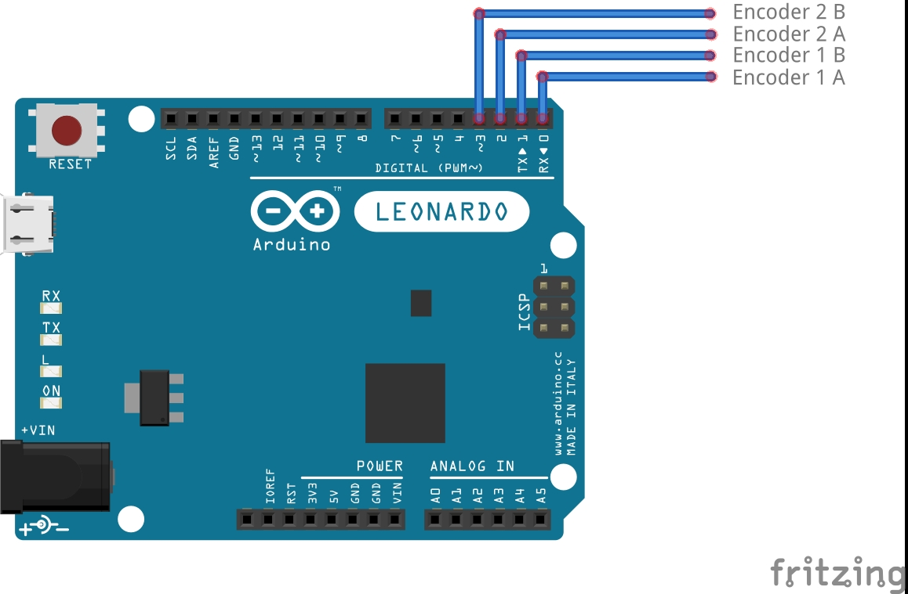

# OpenFFBYoke

A Yoke joystick open source firmware with force feedback on arduino leonardo for flight simulation or other...

#### Firmware OpenFFBYoke to Arduino Leonardo
 - Developing based on adaptFFb 
 - Developing from the AI-Wave version ESP_WHEEL_0.3


```sh
 - 2-Channels encoder and auto calibration side-by-side
 - ailerons and elevator
```
 
##### Schematic

 

### Version

- v0.1 > QuadEncoder library for 2 encoder on pin 0,1,2,3 

### Installation
__________________
#####  - Install the *"Arduino Core"* folder in the Arduino software core folder.
* To facilitate any updating of the core files with the project repository
```sh
/git-directory/arduino-1.0.5/[arduino.exe | *.dll | hardware/ | libraries/ ]
/git-directory/arduino-1.0.5/(project)[ hardware/ | libraries/ ]
/git-directory/OpenFFBYoke/(project)[ * ]
```

___________________
##### - Atmel Studio 7 & Visual Micro
* I use Atmel studio 7 , is free and good for devloping atmel micro.
* Visual Micro installed on the VS extensions panel.
* It better reports errors.
