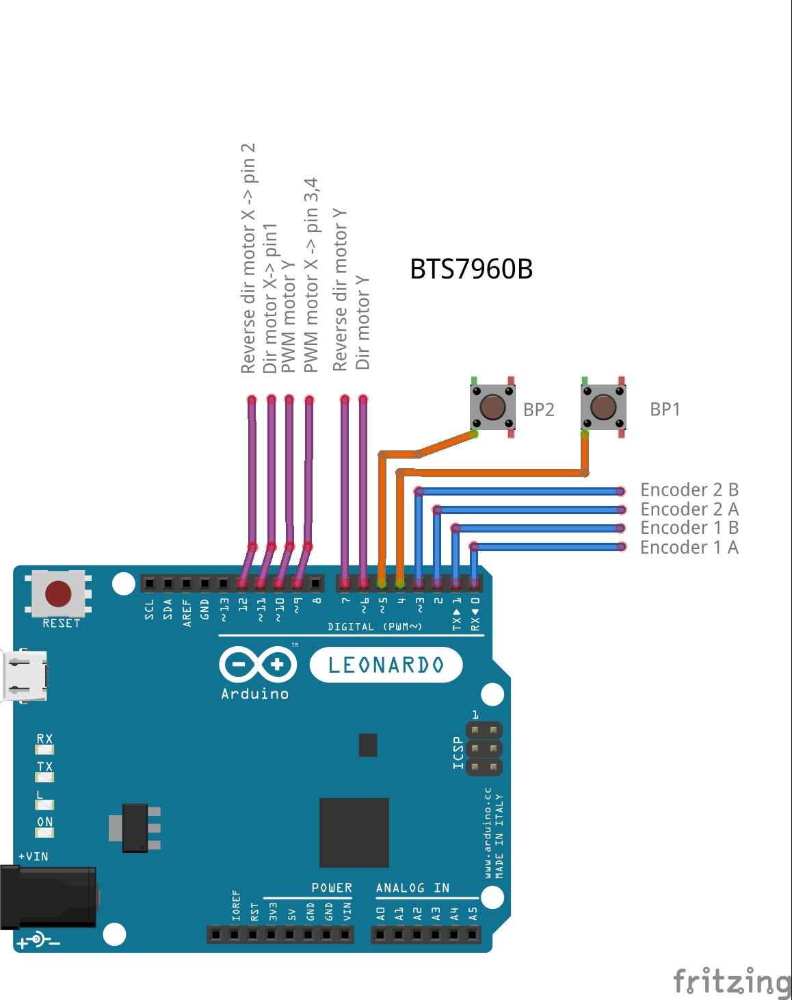

# OpenFFBYoke

## this project is work in progress !!!!!

A Yoke joystick open source firmware with force feedback on arduino leonardo for flight simulation or other...

#### Firmware OpenFFBYoke to Arduino Leonardo
 - Developing based on adaptFFb 
 - Developing from the AI-Wave version ESP_WHEEL_0.3


```sh
 - 2-Channels encoder and auto calibration side-by-side
 - ailerons and elevator
```
 
#### Schematic

 

## Version
__________________
- v0.1 > QuadEncoder library for 2 encoder on pin 0,1,2,3 
- v0.2 > USB joystick function for ailerons and elevator
- v0.3 > add PWM 2 channels on Timer1 for BTS7960B

## Installation
__________________
##### - Atmel Studio 7 & Visual Micro
* I use Atmel studio 7 , is free and good for devloping atmel micro.
* Visual Micro installed on the VS extensions panel.
* It better reports errors.

##### - Dependencies
  
######  Install the *"Arduino Cores"* folder in the Arduino software cores folder.

create a backup of this folder before !

```sh 
  > hardware > arduino > avr > cores > arduino
```
######  Install the *"Arduino Libraries"* folder in the Arduino libraries folder.
